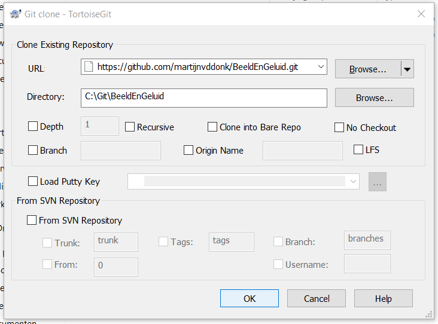
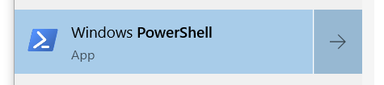
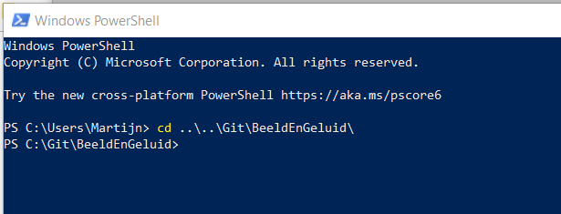
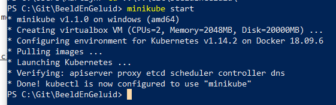
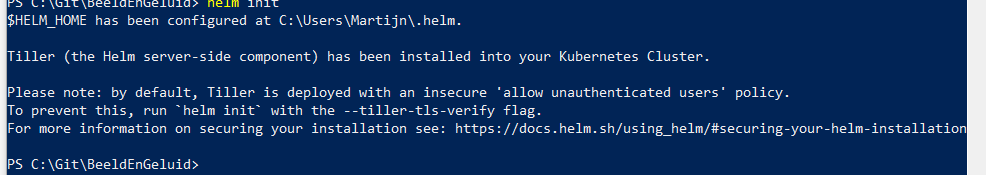
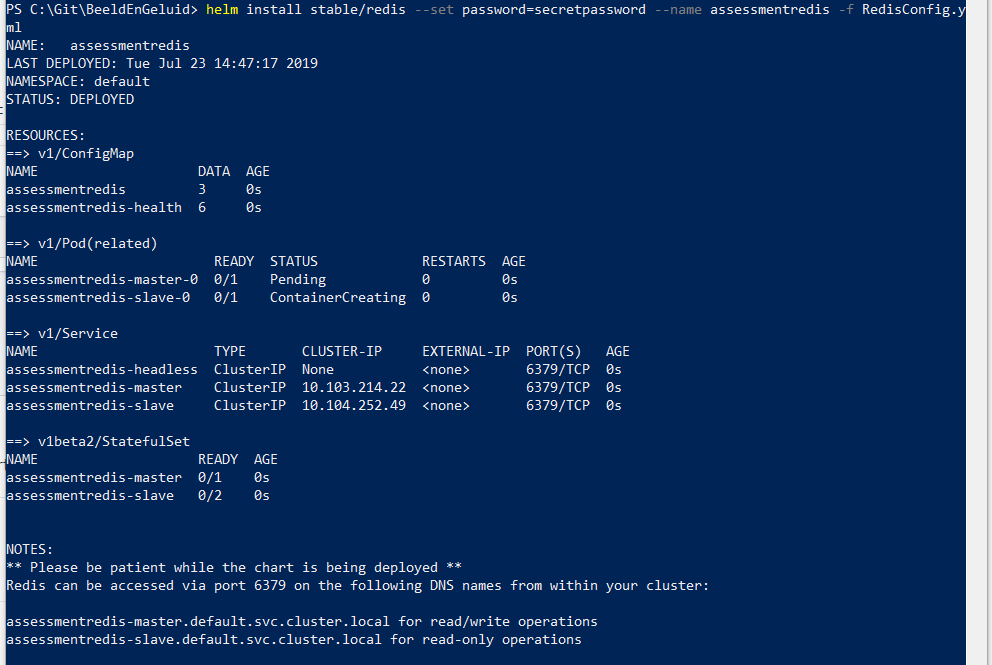
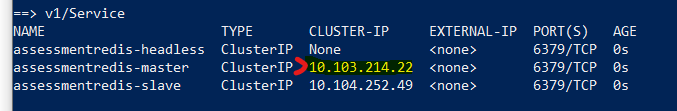
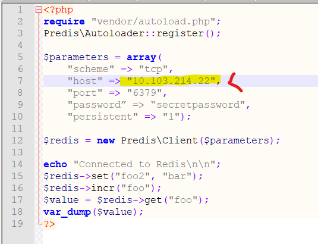
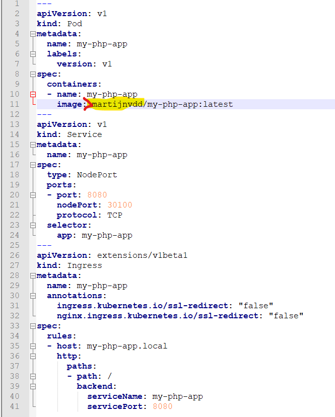

# BeeldEnGeluid

## Wat is dit?
Dit is een assessment opdracht gemaakt voor Beeld en Geluid door Martijn van de Donk op 23 Juli 2019.

De opdracht was het maken van een Kubernetes cluster waarin een Redis cluster draait, en een Webapi die met Redis praat.

## Wat heb ik nodig?
Om dit te draaien heb je in ieder geval een werkende Kubernetes cluster nodig, en een computer met daarop Docker, Kubectl en Helm.

Verder was dit project gebouwd op Windows 10 met een Minikube die in VirtualBox draait, en gaan de instructies ervan uit dat je dat ook hebt. Dit project kan wel draaien in andere clusters, maar dan moet je zelf de instructies aanpassen.

VirtualBox kan je hier vinden: https://www.virtualbox.org/wiki/Downloads

En al je Kubernetes benodigdheden kan je installeren met Chocolatey: `choco install kubernetes-cli` en 
`choco install kubernetes-helm`

(Zie ook: https://chocolatey.org/packages/kubernetes-cli en https://chocolatey.org/packages/kubernetes-helm)

## Hoe ga ik aan de slag?

#### Clone dit project naar je lokale schijf
Je kunt hiervoor je favoriete git tool gebruiken, dit voorbeeld gebruikt TortoiseGit



#### Open Powershell en ga naar deze map
Open Powershell



En ga naar de map waar je deze repository naartoe gecloned hebt



#### Start Minikube en Helm
Start minikube met het commando `minikube start`.



En initialiseer helm met het commando  `helm init`



#### Start de Redis Cluster
Start de redis cluster is met het commando:
```
helm install stable/redis --set password=secretpassword --name assessmentredis -f RedisConfig.yml
```
(Optioneel: Kies een beter wachtwoord)




Hiermee haal je de officiele Redis Chart uit Helm, en configureer je hem met geconfiguratie uit dit project. In deze configuratie zit een Redis cluster met:

- 1 Redis master pod
- 2 Redis slave pods
- Een Redis headless service
- Een Redis master service
- Een Redis slave service

#### Stop het redis IP in de php app
In de output van net zie je het IP adres van de Redis master service binnen je Kubernetes cluster:



Kopieer deze en zet hem in de het bestand contactredis/contactredis.php



#### Bouw en push de build met Docker
Hier heb ik helaas geen screenshots van omdat Docker bij mij nu niet tegelijk met Minikube wil draaien.

```
cd contactredis
docker build -t martijnvdd/my-php-app .
docker login
docker push martijnvdd/my-php-app
```
Als je dit naar je eigen Docker account wil pushen, moet je martijnvdd vervangen in deze commando's en in my-php-app.yml



#### Start de php app
Start een pod met de php app die Redis aanroept met het commando: `kubectl apply -f .\my-php-app.yml --record`
